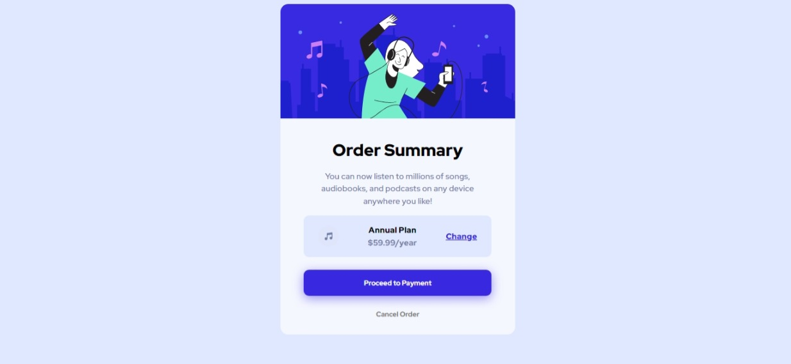

# Frontend Mentor - Order Summary component

Essa é uma solução para o projeto [Order summary component](https://www.frontendmentor.io/challenges/order-summary-component-QlPmajDUj/hub). O Frontend Mentor challenges te ajuda a melhorar as suas habilidades construindo  projetos realistas. 

## Table of contents

- [Overview](#overview)
  - [O desafio](#o-desafio)
  - [Screenshot](#screenshot)
- [Meu processo](#meu-processo)
  - [Criado com](#criado-com)
  - [O Que Aprendi](#o-que-aprendi)
  - [Desenvolvimento contínuo](#desenvolvimento-contínuo)
- [Autor](#autor)

## Overview
Você pode acessar o projeto aqui
- URL: [Projeto](https://davi-damasio.github.io/nft-preview-card-component/)
### O desafio

O usuários devem conseguir:

- Ver o layout otimizado dependendo do tamanho da tela do seu dispositivo.

- Ver estados de hover ao passar o mouse ou tocar pelo celular.

### Screenshot

## Meu processo

### Criado com

- Marcação HTML5
- Propriedades costumizadas css
- Workflow Mobile-first

### O Que Aprendi

### Desenvolvimento contínuo

## Autor

- Website - [Davi Damasio](https://github.com/Davi-Damasio)
- Frontend Mentor - [@davi-damasio](https://www.frontendmentor.io/profile/Davi-Damasio)

"# INTERACTIVE-RATING-COMPONENT" 
"# interactive-rating-component-main" 
"# nft-preview-card-component" 
"# order-summary-component" 
